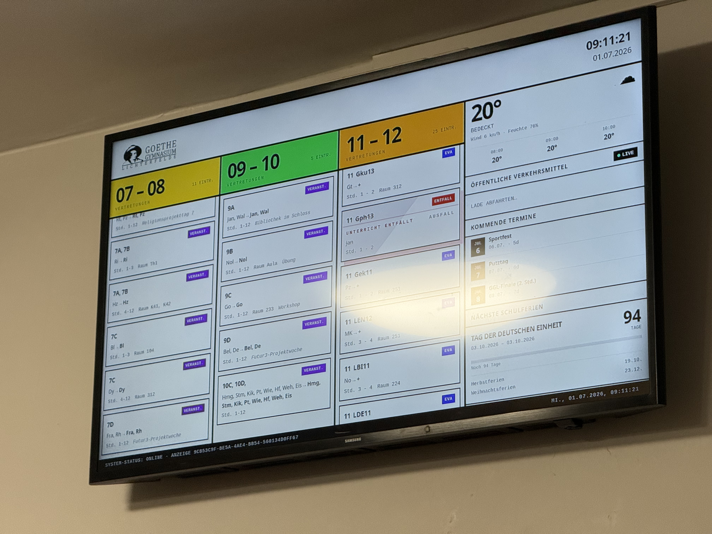
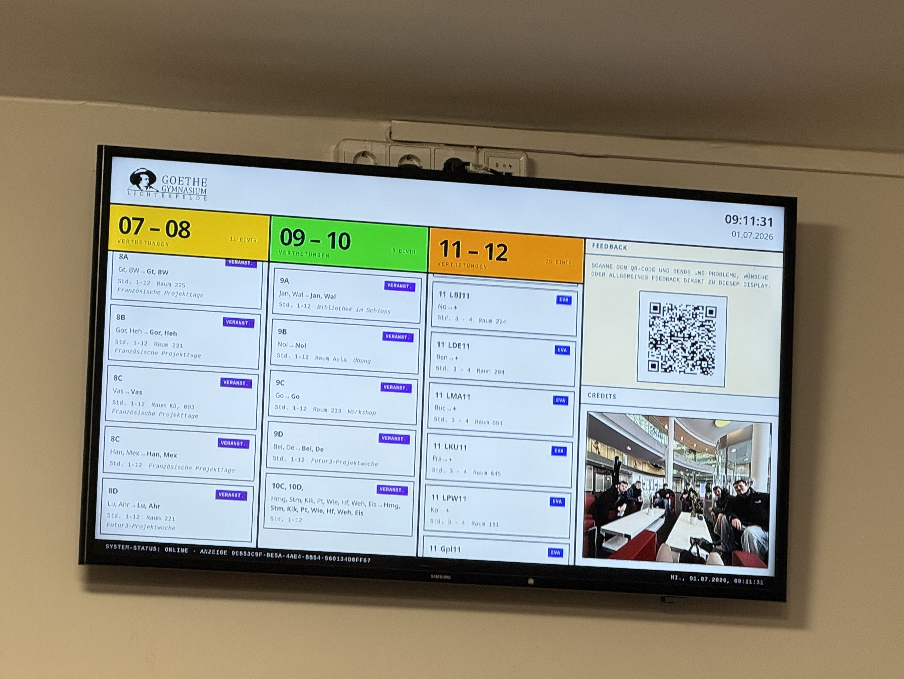
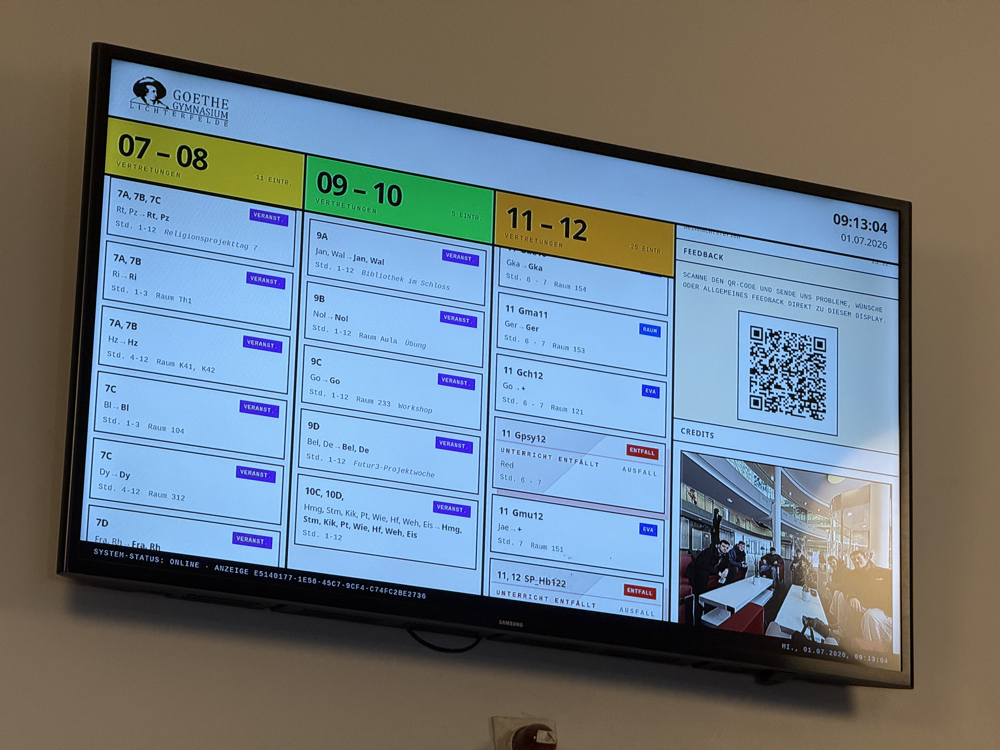
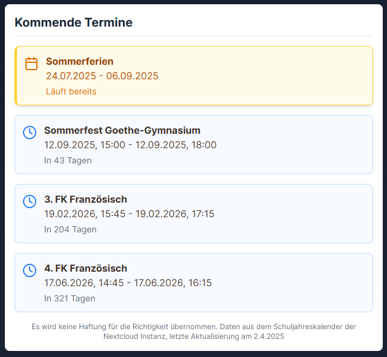

<p align="center">
  <picture><source media="(prefers-color-scheme: dark)" srcset="https://shieldcn.dev/header/grid.svg?title=School+Dashboard&amp;subtitle=GGL+lobby+information%2C+rebuilt+as+a+calm+real-time+school+dashboard.&amp;logo=https%3A%2F%2Farchive.org%2Fdownload%2Fggl-logo-head-only%2FGoethe-Nur-Kopf.png&amp;logoColor=c7ceda&amp;mode=dark" /></picture>
</p>

<p align="center">
  <picture><source media="(prefers-color-scheme: dark)" srcset="https://shieldcn.dev/github/ci/zzackllack/school-dashboard.svg?variant=secondary" /></picture>
  <picture><source media="(prefers-color-scheme: dark)" srcset="https://shieldcn.dev/github/license/zzackllack/school-dashboard.svg?variant=secondary" /></picture>
  <picture><source media="(prefers-color-scheme: dark)" srcset="https://shieldcn.dev/badge/Frontend-TanStack_Start-0f766e.svg?variant=secondary&amp;logo=react" /></picture>
  <picture><source media="(prefers-color-scheme: dark)" srcset="https://shieldcn.dev/badge/Backend-Spring_Boot-6db33f.svg?variant=secondary&amp;logo=springboot" /></picture>
  <picture><source media="(prefers-color-scheme: dark)" srcset="https://shieldcn.dev/badge/Package_mgr-pnpm-F69220.svg?variant=secondary&amp;logo=pnpm" /></picture>
</p>

<p align="center">
  <strong>A production dashboard for Goethe Gymnasium Lichterfelde that turns one passive lobby screen into a useful, readable school information hub.</strong>
</p>

<p align="center">
  <a href="#live-at-ggl">Live at GGL</a> ·
  <a href="#what-it-shows">What it shows</a> ·
  <a href="#project-state">Project state</a> ·
  <a href="#developer-notes">Developer notes</a>
</p>

## Live at GGL

This dashboard is not just a MVP. It has been running on two locations at Goethe Gymnasium Lichterfelde, showing the substitution plan, weather, holidays, calendar events, and nearby public transport where students actually pass by.

<p align="center">
  
  
  
</p>

## Why this exists

The old lobby display was hard to read, visually dated, and mostly limited to substitution information. School Dashboard was built to collect the information students and staff repeatedly need during the day into one calm, glanceable display: substitutions, weather, public transport, school events, holidays, and time.

It started as a GGL-specific project, but the structure is intentionally adaptable for other schools using DSBmobile and similar public data sources.

## What it shows

| Area | What students see | Data source / integration |
| --- | --- | --- |
| 📋 Substitution plan | Current class changes, including course-level changes for upper grades, with cached fallback data when upstream calls fail | DSBmobile via a Java integration |
| 🌤️ Weather | Current conditions and forecast cards | Open-Meteo |
| 🚌 Public transport | Nearby bus and train departures, route information, and delays | BVG / VBB transport API |
| 📅 Calendar | Upcoming school events and important dates | iCal calendar feed |
| 🏖️ Holidays | Berlin school holiday information | Senatsverwaltung für Bildung, Jugend und Familie Berlin |
| 🕒 Clock | Large date and time display for the lobby screen | Browser/runtime time |

## Technical shape

| Layer | Stack |
| --- | --- |
| 🖥️ Frontend | React 19, TypeScript, TanStack Start, TanStack Router, TanStack Query, Tailwind CSS, Vite, Nitro |
| ☕ Backend | Java 21, Spring Boot, REST endpoints, caching, Flyway migrations |
| 🗄️ Data | H2 for development, PostgreSQL 17 for production |
| 🧪 Testing | Vitest, Playwright, JUnit 5, Mockito |
| 🚢 Deployment | Backend via Docker, frontend via Cloudflare Workers, currently hosted on private infrastructure |

## Project state

This project is feature-complete for its original school use case. I have finished my Abitur and am leaving the school, so I do not plan to keep adding product features myself.

The repository may continue under the school's GitHub organization, and I will still take care of critical security updates, hosting-related maintenance, and serious operational issues where needed.

| Phase | Status |
| --- | --- |
| Core API integration and first dashboard UI | ✅ Done |
| Additional modules and visual refinement | ✅ Done |
| Testing, performance, and deployment hardening | ✅ Done |
| Documentation refresh | ✅ Done |
| New feature development by original maintainer | 🛠️ Maintenance only |

## Screenshots

<details>
<summary>Open application screenshots (Legacy)</summary>

<br>

<p align="center">
  
</p>

<p align="center">
  
  
  
  
</p>

</details>


## Developer notes

<details>
<summary>Quick local setup</summary>

### Prerequisites

- JDK 21
- Node.js 24+ with pnpm enabled through `corepack enable`
- Maven, only needed once if Maven Wrapper files are missing

### Start locally

```bash
git clone https://github.com/Zzacklack/school-dashboard.git
cd school-dashboard
pnpm run setup
pnpm run dev
```

`pnpm run setup` performs the local credential and URL bootstrap and writes:

- `Backend/.env`
- `Frontend/.env`

These files are local-only and must never be committed.

Local URLs:

- Frontend: <http://localhost:3000>
- Backend API: <http://localhost:8080>

</details>

<details>
<summary>Backend and database notes</summary>

The backend uses one committed Spring configuration file at `Backend/src/main/resources/application.properties`. Runtime values are provided through environment variables, with safe defaults where possible.

Common overrides:

- `DSB_USERNAME` -> `dsb.username`
- `DSB_PASSWORD` -> `dsb.password`
- `CALENDAR_ICS_URL` -> `calendar.ics-url`
- `SPRING_DATASOURCE_URL` -> `spring.datasource.url`
- `SERVER_SERVLET_SESSION_COOKIE_SECURE` -> `server.servlet.session.cookie.secure`

Session and cookie notes:

- `SECURITY_SESSION_IDLE_TIMEOUT` controls app-level idle invalidation.
- `SERVER_SERVLET_SESSION_TIMEOUT` can set the container session timeout; the shorter timeout effectively applies.
- If `SECURITY_CORS_ALLOWED_ORIGINS` includes `http://localhost`, set `SERVER_SERVLET_SESSION_COOKIE_SECURE=false` for local HTTP cookie-based auth.

Flyway runs automatically on startup. Production PostgreSQL migrations live under `Backend/src/main/resources/db/migration/postgresql`; local H2 migrations live under `Backend/src/main/resources/db/migration/h2`.

Useful commands:

```bash
mvn -f Backend/pom.xml spring-boot:run
mvn -f Backend/pom.xml test
mvn -f Backend/pom.xml clean package -DskipTests
```

The local H2 database persists plan snapshots under `Backend/data/`.

</details>

<details>
<summary>Frontend, checks, and CI</summary>

Frontend commands:

```bash
pnpm install --frozen-lockfile
pnpm --dir Frontend run dev
pnpm --dir Frontend run build
pnpm --dir Frontend run lint
pnpm --dir Frontend run test:unit
pnpm --dir Frontend run test:integration
pnpm --dir Frontend run test:web
```

Repository-level helpers:

```bash
pnpm run format:check
pnpm run format
pnpm run lint
pnpm run test
pnpm run build
```

CI covers formatting, tests, CodeQL, and Docker image publishing through GitHub Actions.

</details>

<details>
<summary>Backend API endpoints</summary>

All endpoints are served from the backend base URL, usually `http://localhost:8080`.

| Endpoint | Purpose |
| --- | --- |
| `GET /health` | Lightweight health response with status and timestamp |
| `GET /api/substitution/plans` | Substitution plan data with cached fallback on errors |
| `GET /api/dsb/timetables` | Raw DSBmobile timetables list |
| `GET /api/dsb/news` | DSBmobile news payload |
| `GET /api/calendar/events?limit=5` | Parsed calendar events with epoch millis and `allDay` |
| `GET /error` | HTML error page handler |

Optional actuator endpoints depend on `management.endpoints.web.exposure.include`:

- `GET /actuator/health`
- `GET /actuator/info`
- `GET /actuator/metrics`
- `GET /actuator/env`

</details>

<details>
<summary>Production deployment</summary>

Backend production deployments use Docker and PostgreSQL. Frontend deployment is configured for Cloudflare Workers.

Frontend Workers configuration:

- Wrangler config: `Frontend/wrangler.toml`
- Production domain: `goethe-dashboard.zacklack.de`
- Preview URLs are enabled through `preview_urls = true` and `workers_dev = true`

Cloudflare Workers build settings:

- Root directory: repository root (`/`)
- Build command: `pnpm --dir Frontend run build:workers`
- Deploy command: `pnpm --dir Frontend run deploy:workers`
- Non-production branch deploy command: `pnpm --dir Frontend run deploy:workers:preview`

Backend environment essentials:

```bash
SPRING_DATASOURCE_URL=jdbc:postgresql://postgres:5432/school_dashboard
SPRING_DATASOURCE_USERNAME=school_dashboard
SPRING_DATASOURCE_PASSWORD=<strong-password>
SPRING_FLYWAY_LOCATIONS=classpath:db/migration/postgresql
```

Docker deployment:

```bash
cd Docker
docker compose -f docker-compose.yaml build
docker compose -f docker-compose.yaml up -d
docker compose -f docker-compose.yaml ps
```

Legacy H2 backups can be imported into PostgreSQL:

```bash
PG_URL="postgresql://localhost:5432/school_dashboard" \
PG_USER="school_dashboard" \
PG_PASSWORD="<strong-password>" \
H2_PASSWORD="" \
./scripts/prod/import-h2-legacy-to-postgres.bash Backend/data/backup/20260307-181933
```

</details>

<details>
<summary>The DSBmobile integration story</summary>

DSBmobile was the hardest integration in the project. Early attempts with Python libraries ran into authentication problems, inconsistent payloads, and undocumented changes. The practical solution ended up being a much older Java implementation that handled the real service behavior more reliably than the newer options.

The frustrating part is not the data model itself; it is the lack of a stable public API for a system used by many schools. That opacity forces school-side projects into reverse-engineered integrations for data that should be straightforward to access.

</details>

## Contributing

Contributions are welcome, especially from people continuing the project for GGL or adapting it for another school. Please read [CONTRIBUTING.md](CONTRIBUTING.md), keep secrets out of commits, and run the relevant checks before opening a pull request.

## Acknowledgements

- [DSBmobile-API](https://github.com/Sematre/DSBmobile-API) by [Sematre](https://github.com/Sematre/) for the Java implementation that made the core substitution-plan integration workable.
- [BVG transport API](https://v6.bvg.transport.rest/) for Berlin public transport data.
- [Open-Meteo](https://open-meteo.com/) for weather data.
- [Weather-Sense/Icons](https://github.com/Leftium/weather-sense) by [Leftium](https://github.com/Leftium/) for weather icons.
- [Saloking / Nikolas](https://github.com/nikolas-bott) for the decisive hint to use the Java DSBmobile API instead of losing more time to broken Python options.
- Goethe Gymnasium Lichterfelde for the opportunity to improve the school's information display.

## License

School Dashboard is licensed under the BSD 3-Clause License. See [LICENSE](LICENSE) for details.

<p align="center">
  <a href="https://github.com/zzackllack/school-dashboard/graphs/contributors"><picture><source media="(prefers-color-scheme: dark)" srcset="https://shieldcn.dev/contributors/zzackllack/school-dashboard.svg?bots=true&amp;mode=dark" /></picture></a>
</p>
